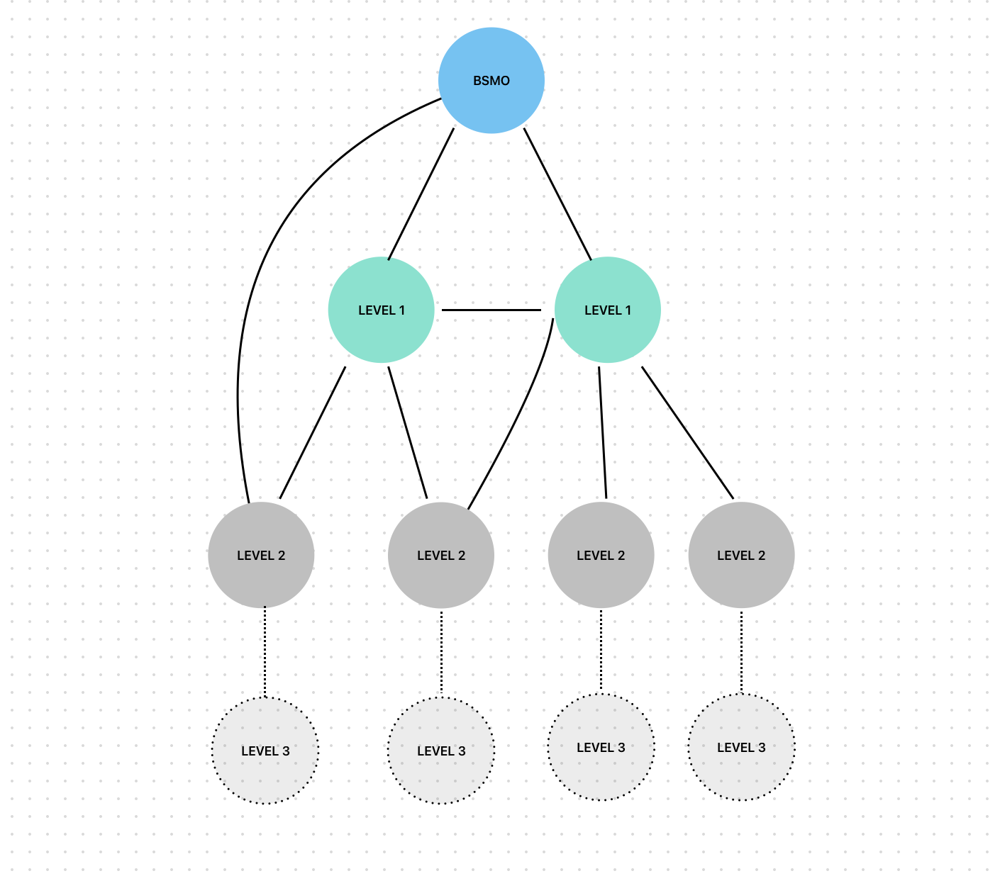

## OUTPUT



## Структура
```
└── task_2_vk_graph
    ├── analyzer.py
    ├── graph.py
    ├── main.py
    ├── models.py
    └── vk_api.py
```


### [main.py](main.py)
Принцип работы программы:
```python
async def main():
    data = await collect_data()
    graph = get_graph(data=data)
    show_analyze(graph=graph)
```


### [vk_api.py](vk_api.py)
Получает данные от VK API:
```
└── user_1
    ├── users_user_1_1
    ├── ...
    ├── users_user_1_N
└── user_2
    ├── users_user_2_1
    ├── ...
    ├── users_user_2_N
└── ...
└── user_K
```


### [graph.py](graph.py)
Переводит ответ с API в объект Graph
```python
from networkx import Graph
data = ...
g = Graph(data)
```


### [analyzer.py](analyzer.py)
Определяет центральность графа:
- По посредничеству собственного вектора
- По близости собственного вектора
```python
from networkx import Graph, betweenness_centrality, eigenvector_centrality

class GraphAnalyzer:
    def __init__(self, graph: Graph):
        self.graph = graph

    def analyze(self):
        # Центральность по посредничеству
        betweenness = betweenness_centrality(self.graph)
        
        # Близость собственного вектора
        eigenvector = eigenvector_centrality(self.graph)
        
        return betweenness, eigenvector
```


### [models.py](models.py)
Хранит модель ответа с VK API.
```python
from pydantic import BaseModel


class GetUserFriendsResponse(BaseModel):
    count: int = 0
    items: list[int] = []

```