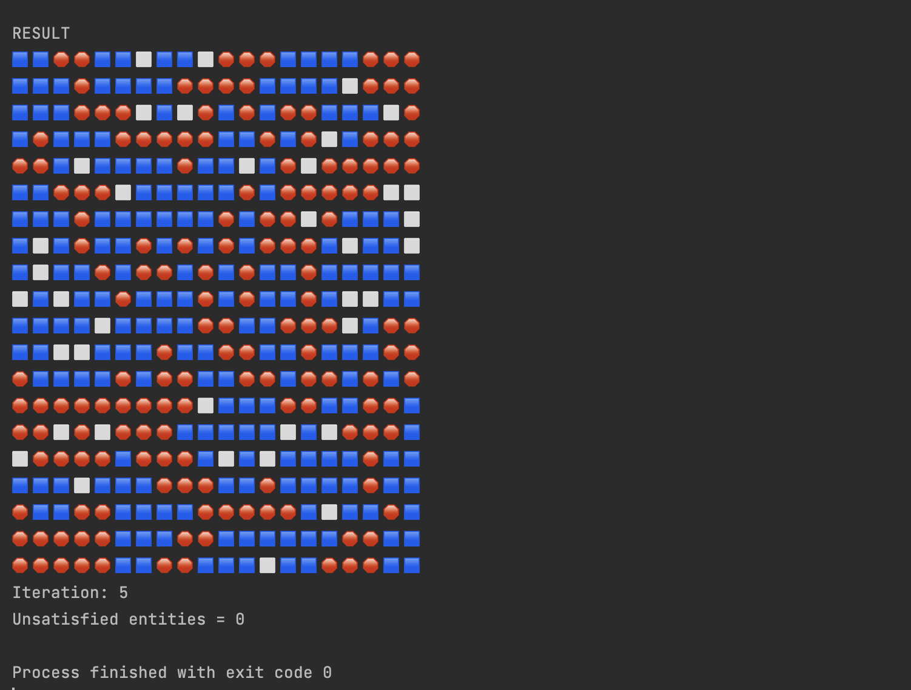

# Schelling Model

Inspired by [topic by Adil Moujahid](https://adilmoujahid.com/posts/2020/05/streamlit-python-schelling/)

## Вывод

### С использованием библиотеки

Есть управление

- размер поля
- Доли свободных и занятых клеток
- Отношение синих к красным


Для запуска:
```bash
streamlit run visualizer.py
```

### Консольный



## Code structure


### Принип работы программы:

```python
model = SchellingModel(...)

while True:
    model.do_iteration()
    model.recalculate_ranks()

    if model.is_everyone_satisfied():
        break

model.print_info()
```

## Tests

У нас также есть unit-tests на логику определение таблицы удовлетворенности сущностей.

/[test_rank.py](test_rank.py)


## Динамика изменения


