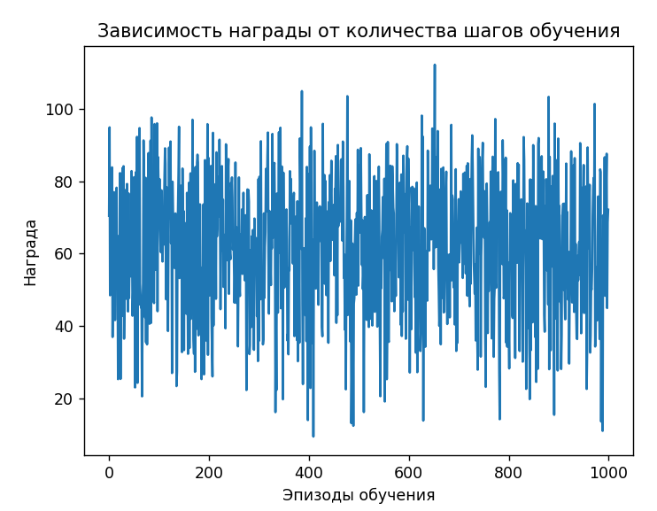
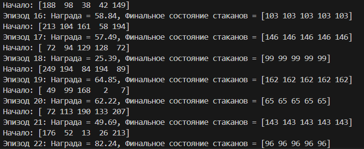

# Балансировка стаканов через обучение подкреплением

### Цель задачи

Цель - достичь состояния, где уровень воды в каждом из N стаканов равен D (где N и D - параметры задачи).

### Основные компоненты проекта

- `GlassEnvironment`: класс среды, моделирующей стаканы и их взаимодействие.
- `QLearningAgent`: агент, использующий Q-learning для решения задачи.
- `train()`: основной цикл обучения.

## Настройка параметров

В начале файла можно настроить следующие параметры:
- `NUM_GLASSES`: количество стаканов
- `MAX_STEPS`: максимальное количество шагов в эпизоде
- `EPISODES`: количество эпизодов обучения
- `ALPHA`, `GAMMA`, `EPSILON`: гиперпараметры Q-learning

## Результаты

После запуска обучения вы увидите:
- График наград по эпизодам
- Примеры финальных состояний после первого и последнего эпизода

### Граф 

### Консольный вывод

